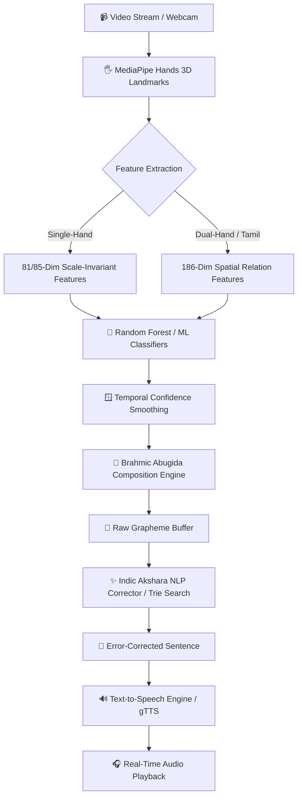

# 🤟 Multilingual Real-Time Sign Language to Text & Speech System

An end-to-end, real-time sign language recognition, composition, correction, and speech synthesis system supporting Indian languages: **Kannada (ಕನ್ನಡ)**, **Hindi (हिंदी)**, and **Tamil (தமிழ்)**.

---

## 🌟 Key Highlights

- **Multilingual Support**: Real-time sign recognition for **Kannada** (49 classes), **Hindi** (43 classes), and **Tamil** (31 classes).
- **Computer Vision & Hand Landmark Tracking**: Powered by MediaPipe Hands for 21 3D landmark extraction per hand at 30 FPS.
- **Scale & Rotation Invariant Geometric Features**:
  - **81-Dimensional Single-Hand Features**: Normalized 3D coordinates, fingertip-to-wrist distances, adjacent fingertip spacings, and knuckle structural vectors invariant to hand size, distance, and zoom.
  - **85-Dimensional Extended Features**: Adds 3D tilt angles and finger curl ratios for finer sign discrimination.
  - **186-Dimensional Dual-Hand Spatial Features**: Specialized multi-hand spatial relation vectors for two-handed Tamil sign gestures.
- **Brahmic Abugida Composition Engine**: Automatically merges consonants and vowel modifiers (*matras*) into natural syllabic grapheme clusters (e.g., ಕ + ಆ → ಕಾ, क + आ → का, க + ஆ → கா) and handles virama/halant/pulli conjuncts.
- **Fast Indic NLP Error Correction**:
  - Akshara-level Levenshtein distance matching.
  - Visual sign-confusion cost matrix (e.g., Kannada ದ ↔ ರ, Hindi ब ↔ व, Tamil ர ↔ ற).
  - Fingerspelling geminate & virama resolution (e.g., `ಕನನಡ` → `ಕನ್ನಡ`, `बचचा` → `बच्चा`, `மககள்` → `மக்கள்`).
  - High-speed Trie dictionary search (< 0.5 ms) with dynamic custom vocabulary support and optional IndicBART neural refinement.
- **Natural Text-to-Speech (TTS)**: High-fidelity native voice synthesis using Google TTS (`gTTS`) and offline fallback (`pyttsx3`) with in-memory caching.
- **Modern Interactive Web UI**: Streamlit dark-mode slate dashboard featuring live camera feeds, confidence gauges, top-3 prediction distributions, hands-free auto-commit, and full sentence editing controls.

---

## 🏗️ Architecture & Pipeline



---

## 📁 Project Structure

```plaintext
Sign_Language_Detection_2/
├── app.py                         # Main Streamlit web application & real-time dashboard
├── detector.py                    # MediaPipe hand tracker & 81/85/186-dim feature extractors
├── composer.py                    # Brahmic Abugida script composition & matra attachment engine
├── corrector.py                   # Akshara-level NLP error corrector, Trie index & IndicBART
├── tts.py                         # Multilingual Text-to-Speech synthesis & audio player
├── requirements.txt               # Project dependencies
├── models/                        # Pre-trained ML classifiers & label mappings
│   ├── kannada_model.pkl          # Kannada trained classifier
│   ├── kannada_classes.json       # Kannada class labels (49 classes)
│   ├── hindi_model.pkl            # Hindi trained classifier
│   ├── hindi_classes.json         # Hindi class labels (43 classes)
│   ├── tamil_model.pkl            # Tamil trained classifier
│   └── tamil_classes.json         # Tamil class labels (31 classes)
├── data/                          # Training datasets & custom vocabulary
│   ├── kannada/                   # Kannada gesture image directories
│   ├── hindi/                     # Hindi gesture image directories
│   ├── tamil/                     # Tamil gesture image directories
│   └── custom_vocab.json          # User-expanded vocabulary storage
├── train_all_81dim_fast.py        # Multi-threaded fast model training script
├── train_robust_models.py         # Robust augmented training pipeline
├── train_tamil_base.py            # Dual-hand Tamil model training script
└── test_modules.py                # Unit & integration verification tests
```

---

## ⚙️ Installation & Setup

### 1. Clone the Repository
```bash
git clone https://github.com/shravya454/Sign_Language_To_Text_-_Speech.git
cd Sign_Language_To_Text_-_Speech
```

### 2. Create and Activate a Virtual Environment
```bash
# Windows
python -m venv venv
.\venv\Scripts\activate

# Linux / macOS
python3 -m venv venv
source venv/bin/activate
```

### 3. Install Dependencies
```bash
pip install -r requirements.txt
```

---

## 🚀 Running the Application

Launch the Streamlit web application:

```bash
streamlit run app.py
```

Once started, open your browser at `http://localhost:8501`.

### 🎮 Application Features & Controls:
1. **Target Language Selector**: Switch between Kannada (ಕನ್ನಡ), Hindi (हिंदी), and Tamil (தமிழ்) dynamically in the sidebar.
2. **Input Modes**:
   - 🟢 **Live Real-Time Feed**: Uses your webcam at 30 FPS.
   - 📸 **Single Photo Snapshot**: Captures a single image from the webcam.
   - 📁 **Upload Image File**: Analyzes uploaded `.jpg`/`.png` image files.
3. **Hands-Free Auto-Detection**: Automatically appends gestures held for ~0.4s (adjustable sensitivity slider).
4. **Sentence Controls**:
   - `➕ Add Sign`: Manually commit current sign.
   - `• Virama / Pulli / Halant`: Attach conjunct modifier (`್`, `्`, `்`).
   - `␣ Add Space`: Add word delimiter.
   - `⌫ Backspace`: Delete last token or syllable.
   - `🗑️ Clear All`: Reset sentence buffers.
   - `✨ Refine IndicBART`: Run deep NLP context refinement.
   - `🔊 Speak Sentence`: Play audio synthesis in native accent.
5. **Custom Vocabulary**: Add custom names or local words to the in-memory Trie dictionary directly through the sidebar.

---

## 🧠 Model Training

To retrain or update classifiers with new dataset samples:

```bash
# Train all language models (Kannada, Hindi, Tamil) with multi-threading
python train_all_81dim_fast.py

# Train robust models with data augmentation
python train_robust_models.py

# Train dedicated dual-hand Tamil model
python train_tamil_base.py
```

---

## 🧪 Testing

Run test verification scripts to validate feature extraction, composition rules, and NLP modules:

```bash
python test_modules.py
python test_hindi.py
python test_extraction.py
```

---

## 📦 Tech Stack

- **Computer Vision**: OpenCV, MediaPipe Hands
- **Machine Learning**: Scikit-Learn (Random Forest, Decision Trees), NumPy, Pandas
- **Natural Language Processing**: Indic grapheme regex, Akshara-level Levenshtein matching, Trie data structures, IndicBART
- **Speech Synthesis**: gTTS (Google Text-to-Speech), pyttsx3, Pygame Mixer
- **User Interface**: Streamlit with custom CSS & dark theme

---

## 🤝 Contributing

Contributions, issues, and feature requests are welcome! Feel free to open an issue or submit a pull request.

---

## 📄 License

This project is licensed under the MIT License - see the LICENSE file for details.
